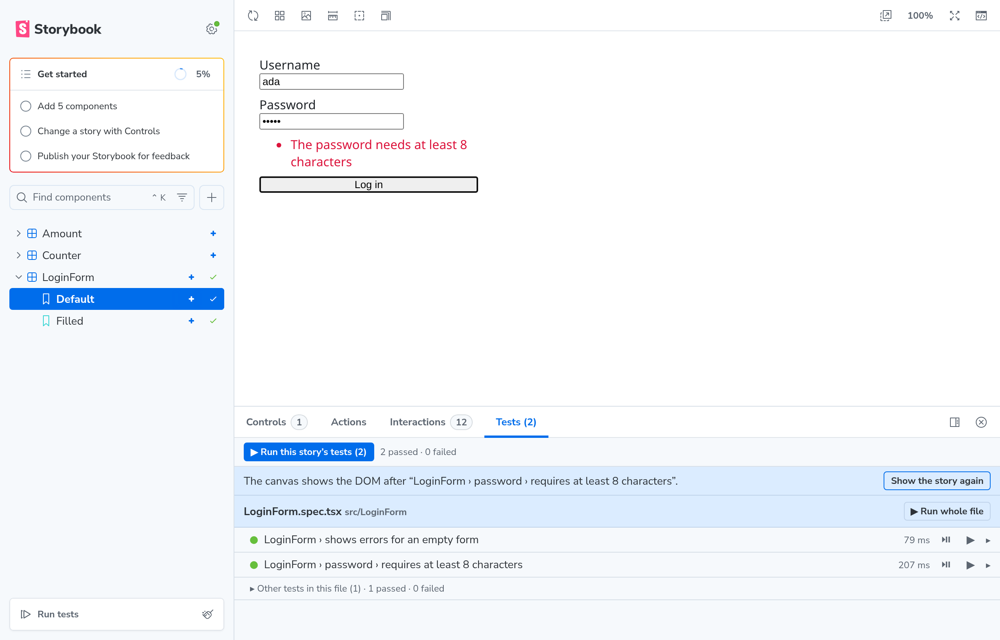
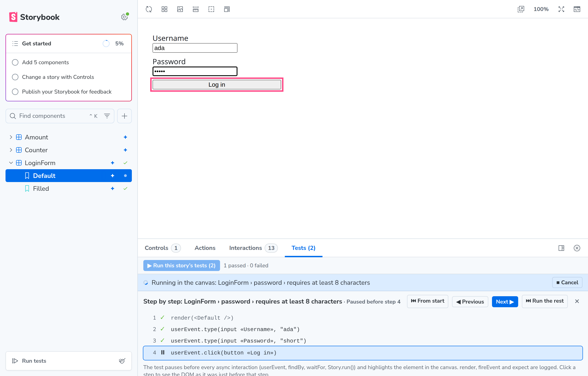
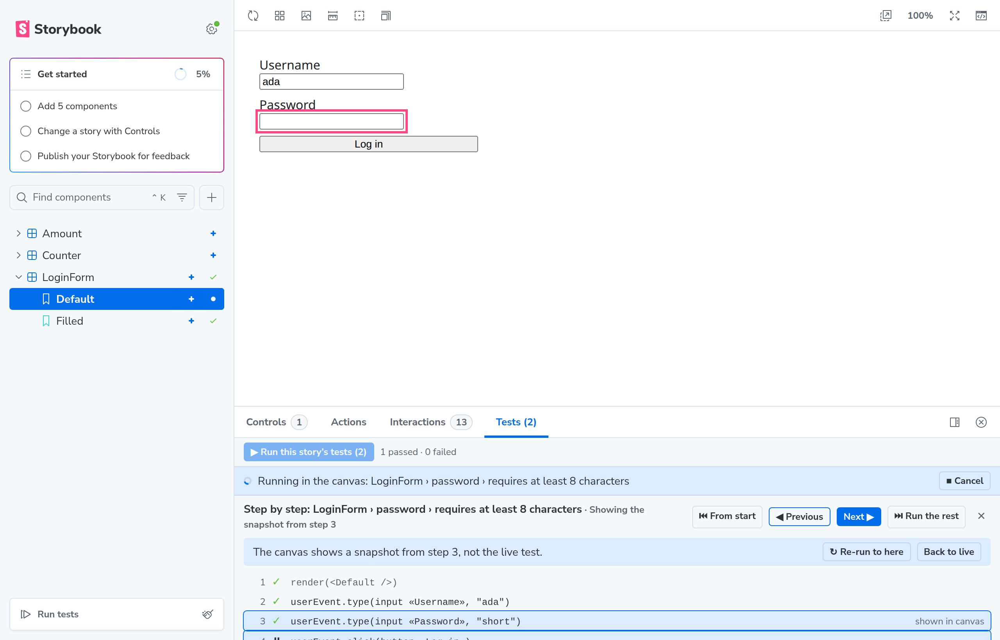

# storybook-addon-testing-library

Run your existing [Testing Library](https://testing-library.com/) specs **inside the Storybook canvas**, listed under
the stories they use — and step through them one interaction at a time.

[](https://www.npmjs.com/package/storybook-addon-testing-library)
[](LICENSE)



Your `*.spec.tsx` files stay exactly as they are, and keep running in Vitest and in CI.

- **See the test run** in the canvas. What the test rendered stays there when it ends, so you can click around in it.
- **Step through it**, with the element the test is about to touch highlighted.

  

- **Look back** at any step. Every step keeps a DOM snapshot, so you can inspect the DOM at the assertion that
  failed — without re-running the test.

  

## Install

```sh
npm install --save-dev storybook-addon-testing-library
```

```ts
// .storybook/main.ts
addons: [
  {
    name: 'storybook-addon-testing-library',
    options: { setupFiles: ['vitest-setup.ts'] },
  },
],
```

You need Storybook 10.6 or later with Vite, React 18 or later, and specs written with `@testing-library/react`. A test
is listed under a story when it uses that story through `composeStories`. You do not need Vitest browser mode,
Playwright or any change to your tests.

The full documentation is in
[the addon's README](packages/storybook-addon-testing-library/README.md#storybook-addon-testing-library): what you
need, options, how tests are linked to stories, and how it compares to Storybook play functions, Vitest browser mode
and `@storybook/addon-vitest`.

## This repository

| Path                                       | What it is                                                              |
| ------------------------------------------ | ----------------------------------------------------------------------- |
| `packages/storybook-addon-testing-library` | The addon itself                                                        |
| `example`                                  | A small React app with components, stories and specs used to try it out |

```sh
npm install
npm run storybook   # builds the addon and opens the example on http://localhost:6006
npm test            # unit tests for the addon, and the example's specs in Vitest
npm run typecheck
npm run build
```

While working on the addon, run `npm run dev` in one terminal (TypeScript in watch mode) and
`npm run storybook -w example` in another. Changes to the manager UI need a Storybook restart; preview changes are
picked up by Vite.

### The example

| Component   | What its tests show                                                                            |
| ----------- | ---------------------------------------------------------------------------------------------- |
| `Counter`   | `composeStories` with `render(<Story />)` and `Story.run()`, plus `it.each` with `%s`          |
| `LoginForm` | `vi.fn`, `userEvent.type`, a nested `describe`, `afterEach`, and a story used through a helper |
| `Amount`    | A spec without `composeStories`, linked by file name, and `it.each` with `$variable`           |

## License

MIT © Tor Røneid
